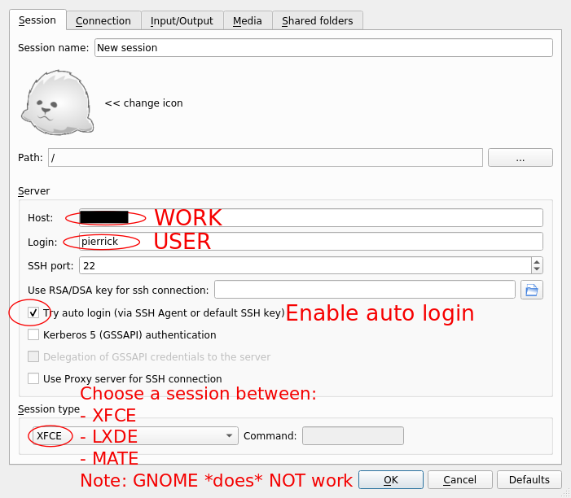
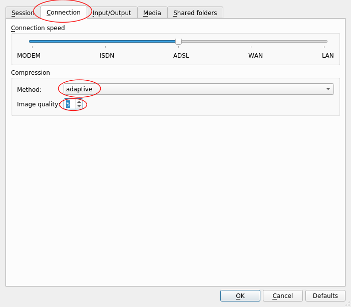
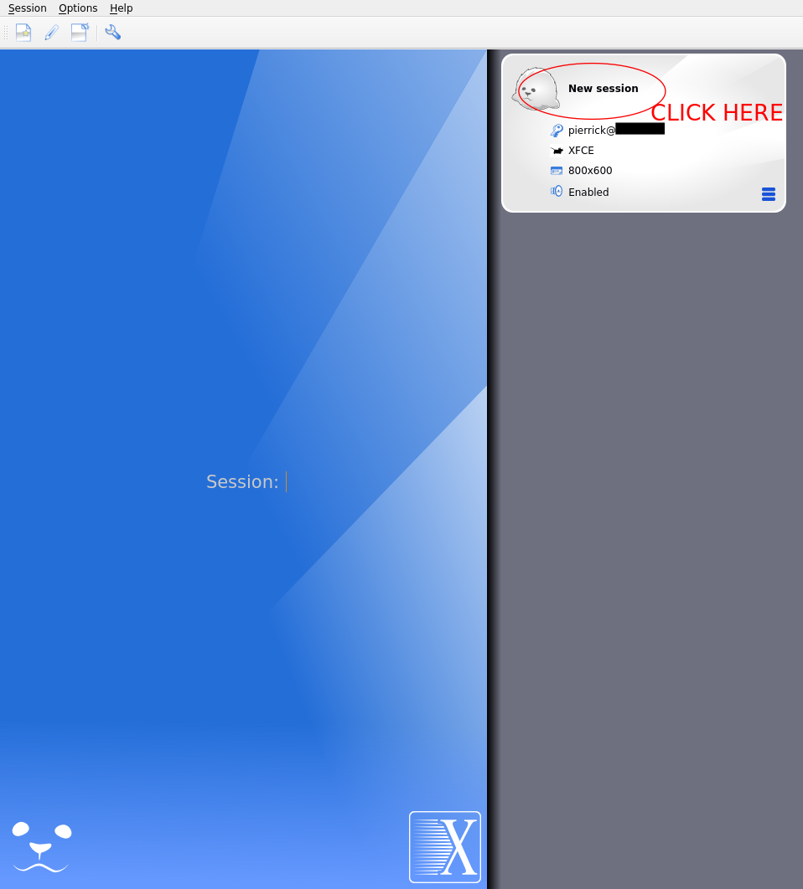
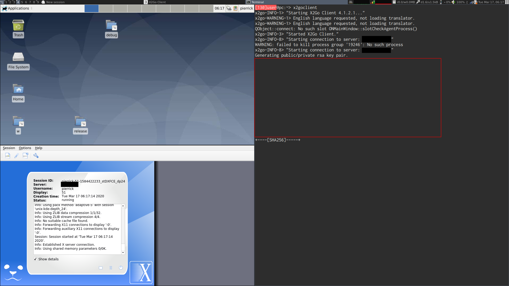
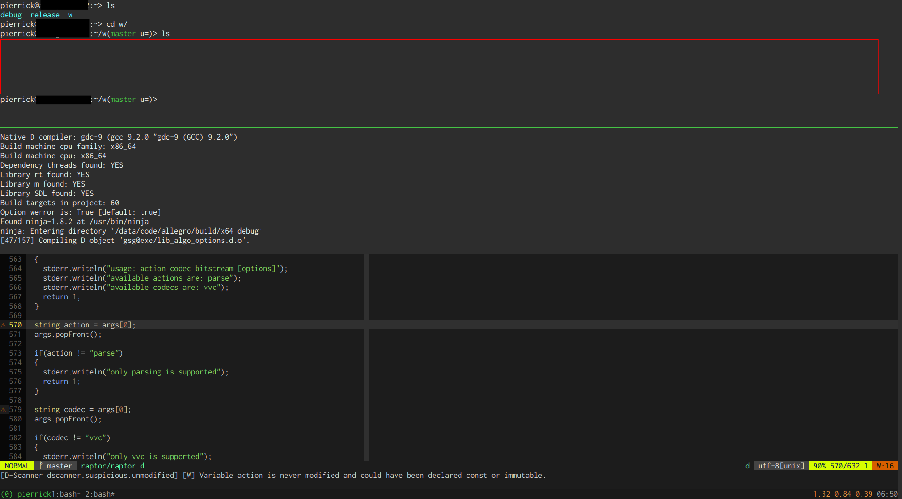

---------------------
Access Linux Remotely
---------------------

This tutorial will allow you to connect to your Linux machine at work, from
home. You can access it from Linux, Windows (7/10) or even MacOS.

In all the following document:

- WORK refers to your work machine (10.X.X.X)
- HOME refers to your machine at home
- USER refers to your user on your WORK machine (pierrick)

Every command is prefixed by the machine on which you must run it:

.. code:: shell

   $(HOME): execute on HOME machine
   $(WORK): execute on WORK machine
   $(HOME|WORK): execute on HOME and WORK machine

-----------------------------------------------------------------------------

Prepare your machine
====================

For Windows/MacOS, see other systems for operation on HOME side.

Update WORK machine and HOME machine
------------------------------------

This tutorial is based on debian >= 10 (Buster, or testing). If you run an older
Debian, please contact IT to update it first. Please update both machines.

Check your debian version using

.. code:: shell

   $(HOME|WORK) cat /etc/debian_version

You should have a number greater or equal than 10, or see "testing", "sid" in
the name.

Please update your machine first, even if it is already at correct version.

.. code:: shell

   $(HOME|WORK) sudo su # spawn root shell
   $(HOME|WORK) apt update && apt upgrade -y && apt dist-upgrade -y

**Do not skip this update step**

VPN access from HOME machine
----------------------------

IT should have transmitted you a config.ovpn file (with another name
potentially).

First, install openvpn and resolvconf

.. code:: shell

   $(HOME) sudo apt update && sudo apt install -y openvpn resolvconf

Then, you should be able to connect to vpn

.. code:: shell

   $(HOME) sudo /usr/sbin/openvpn path/to/your/config.ovpn

When the following line displays

.. code:: shell

   $(HOME) Tue Mar 17 08:21:42 2020 Initialization Sequence Completed

You are now correctly connected. Else, contact IT.

Check ssh access from HOME machine to WORK machine
--------------------------------------------------

You must first ensure you can access your WORK machine with ssh from HOME
machine.

On HOME machine, generate ssh keys

.. code:: shell

   $(HOME) [ -f ~/.ssh/id_rsa ] || ssh-keygen
   # Press enter 3 times

Allow to connect to WORK machine without typing password

.. code:: shell

   $(HOME) ssh-copy-id USER@WORK
   # type password once

   # this command should now run without asking password
   $(HOME) ssh USER@WORK hostname
   # this command should open a dialog box
   $(HOME) ssh -X USER@WORK xmessage Hello

Install needed tools
--------------------

If any of these command fails, please contact IT.

On WORK side

.. code:: shell

   $(WORK) sudo apt update && sudo apt install -y xfce4 lxde mate mosh tmux x2goserver

On HOME side

.. code:: shell

   $(HOME) sudo apt update && sudo apt install -y x2goclient mosh tmux

Both machines are now correctly configured.

Other systems
-------------

On windows, you can install `MobaXterm`__ to have an ssh access.

.. __: https://mobaxterm.mobatek.net/

On macOS, ssh is available by default.

For x2goclient, you can find them on `official webpage (Get X2Go)`__.

.. __: https://wiki.x2go.org

-----------------------------------------------------------------------------

Graphical access
================

To create a graphical session, simply use x2go. It is based on NX protocol, and
offers a much better quality than VNC for the same bandwith. In more, it is
secure by default (it uses ssh under the hoods).

.. code:: shell

   $(HOME) x2goclient

   $(WORK) #Nothing to do! :)

As said, only following sessions work:

- XFCE (recommended)
- MATE
- LXDE

Gnome 3 (which is a **massive** `crap`__) does not work with x2go (and not with
anything in general). Please stop using it even when you will be back.

.. __: https://gitlab.gnome.org/GNOME/gnome-shell/issues/476

- MATE is a fork of Gnome 2 (classic)
- XFCE is a lightweight desktop in the same spirit.
- LXDE is an even lighter desktop.
- Gnome3 is a total crap. You got it?

Try the three, and select the one you prefer. XFCE is the best choice by
default.

Configure a new session

**Do not select GNOME in session type - It does NOT work**

Configure connection (select this tab first) like on this picture (adaptive is
on top of the list)

You can try some other methods and quality as well. Use the one that works the
best for you.

You can now open the session by clicking on session name (New session).

You now have a complete graphical session alive, that you can disconnect and
reconnect from.

-----------------------------------------------------------------------------

Terminal access
===============

Sometimes, you don't need a full graphical environment (text editing, commands).

You can perfectly use SSH. However, if your connection hangs, if latency goes
high, or if you want several terminals, it is not very easy to use.

Several terminals
-----------------

Tmux is a terminal multiplexer (like GNU screen). You can attach and detach from
an existing session (like in graphical).

It does the same than Terminator, but in a single terminal. Thanks to this, it
works remotely without any graphical environment.

Please download this configuration file first:

.. code:: shell

   $(WORK) wget https://raw.githubusercontent.com/second-reality/config-files/master/.tmux.conf -O ~/.tmux.conf
   $(WORK) tmux

A command is sent with a prefix. This is set to <Ctrl-X> by the config. For
example, press Ctrl and X, release, and then press c to open a new window.

List of useful commands:

- <Prefix> c: open a new window
- <Prefix> ": open a new pane
- <Shift>+Left/Right arrow: go to previous/next window (hold Shift)
- <Prefix> Left/Right/Up/Down arrow: go to pane indicated
- <Prefix> d: detach from session
- <Prefix> 1/2/3: Go to window 1/2/3/...

Mouse support works out of the box (scroll with it).

It you want to copy paste, you must hold Shift while copying/pasting.

You can attach to an existing session by doing

.. code:: shell

   $(WORK) tmux attach

better than SSH
---------------

Mosh is an ssh replacement focused on low latency and low bandwith. In
particular, echo of your keystroke does not need a round trip between you and
server, like in SSH. It only synchronizes your terminal state, instead of
sending the whole thing (like ssh). If you lose connection (or close VPN), and
reconnects, it will automatically resynchronize without losing anything.

If you find ssh not very responsive, mosh is the answer you need.

.. code:: shell

   $(HOME) mosh USER@WORK

Since Mosh is only synchronizing terminal state, it does not implement
scrollback of your terminal. Thus, Tmux (or screen) is more or less mandatory.

Terminal hypeness
-----------------

You can now enjoy a full modern terminal workflow

.. code:: shell

   $(HOME) mosh USER@WORK tmux

